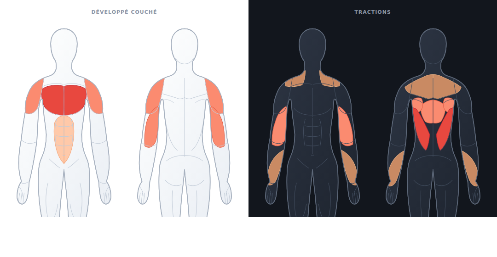

# Schéma musculaire — app d'entraînement

Silhouettes anatomiques vue de face et vue de dos, avec chaque groupe
musculaire adressable et colorable selon son intensité de sollicitation.



Le dessin est vectoriel, sans dépendance, et ne pèse rien : les deux figures
font ~20 ko de SVG au total.

## Utilisation

```html
<link rel="stylesheet" href="muscle-map/muscle-map.css">
<div id="schema"></div>
<script src="muscle-map/assets/figures.js"></script>
<script src="muscle-map/muscle-map.js"></script>
<script>
  const map = MuscleMap.mount('#schema', { view: 'both' });
  map.set({ chest: 'primary', shoulders: 'secondary', triceps: 'secondary', abs: 'light' });
</script>
```

`assets/figures.js` embarque les SVG sous forme de chaînes : la page marche
donc en `file://`, sans serveur et sans requête réseau. Les fichiers
`assets/body-front.svg` et `assets/body-back.svg` restent disponibles si tu
préfères les inclure toi-même.

## API

| Appel | Effet |
| --- | --- |
| `MuscleMap.mount(cible, options)` | Monte le schéma dans l'élément (sélecteur ou nœud). |
| `map.set({...})` | Remplace entièrement la sollicitation affichée. |
| `map.update({...})` | Fusionne avec l'état courant (`0` retire un muscle). |
| `map.clear()` | Remet tout au repos. |
| `map.get()` | Copie de l'état, ex. `{ chest: 3, triceps: 2 }`. |
| `map.levelOf('lats')` | Intensité d'un muscle (0–3). |
| `map.setView('front' \| 'back' \| 'both')` | Change la vue ; l'état est conservé. |
| `map.muscles()` | Clés présentes dans la vue affichée. |
| `map.on('select' \| 'change', fn)` | Écoute les interactions. |
| `map.destroy()` | Démonte et retire les écouteurs. |

Options de `mount` : `view` (défaut `'front'`), `interactive` (défaut `true`),
`cycle` (intensités parcourues au clic, défaut `[0, 3]`), `levels`, `onSelect`,
`onChange`, `figures`, `labels`.

## Intensités

| Niveau | Alias acceptés | Rendu |
| --- | --- | --- |
| `0` | `none`, `off`, `repos` | au repos |
| `1` | `light`, `stabilizer`, `secondaire` | pêche clair |
| `2` | `medium`, `secondary`, `synergiste` | corail |
| `3` | `heavy`, `primary`, `principal` | rouge soutenu |

Une clé inconnue est acceptée et conservée dans l'état, mais ne dessine rien.

## Groupes musculaires

Une clé vaut pour les deux côtés du corps : allumer `biceps` colore les deux bras.

| Vue de face | Vue de dos |
| --- | --- |
| `neck` — Cou | `neck` — Cou |
| `traps` — Trapèzes | `traps` — Trapèzes |
| `shoulders` — Épaules | `shoulders` — Épaules |
| `chest` — Pectoraux | `rhomboids` — Rhomboïdes |
| `abs` — Abdominaux | `upper_back` — Haut du dos |
| `obliques` — Obliques | `lats` — Grand dorsal |
| `biceps` — Biceps | `lower_back` — Lombaires |
| `forearms` — Avant-bras | `triceps` — Triceps |
| `quads` — Quadriceps | `forearms` — Avant-bras |
| `adductors` — Adducteurs | `glutes` — Fessiers |
| `calves` — Mollets | `hamstrings` — Ischio-jambiers |
| | `calves` — Mollets |

Les clés communes aux deux vues (`neck`, `traps`, `shoulders`, `forearms`,
`calves`) s'allument des deux côtés à la fois quand la vue `both` est affichée.

## Couleurs

Tout passe par des variables CSS posées sur `.mm-figure` ; on les redéfinit
depuis l'extérieur sans toucher aux SVG :

```css
.mm-figure {
  --mm-skin-a: #fdfefe;  --mm-skin-b: #e6ebf2;   /* dégradé du corps */
  --mm-edge: #a7b1bf;    --mm-line: #c3ccd8;     /* contour et traits fins */
  --mm-l1: #ffc9a9;      --mm-l1-b: #f3a97f;     /* stabilisateur : fond, bord */
  --mm-l2: #fb8b70;      --mm-l2-b: #e2614a;     /* synergiste */
  --mm-l3: #e8483f;      --mm-l3-b: #c02733;     /* principal */
}
```

Les variables doivent être posées **sur `.mm-figure`** (ou plus spécifique) :
une déclaration sur un parent ne l'emporterait pas sur la valeur par défaut,
que le SVG pose sur lui-même.

`muscle-map.css` fournit déjà une variante sombre, déclenchée par
`prefers-color-scheme: dark` ou par `data-theme="dark"` sur `<html>`.

## Modifier le dessin

Les SVG sont **générés** : ne les édite pas à la main, ils seront écrasés.

Toute la géométrie vit dans `build_muscle_map.py`, décrite en demi-figure
(côté droit uniquement) ; le script se charge du miroir, donc la symétrie est
exacte et il n'y a qu'un jeu de coordonnées à retoucher par muscle.

```bash
python3 build_muscle_map.py     # réécrit assets/body-*.svg et assets/figures.js
```

Deux points de construction à connaître :

- la silhouette est **un seul contour continu** (tête, épaule, bras à l'aller
  par la face externe et au retour par la face interne, creux de l'aisselle,
  flanc, jambe) — le vide entre le bras et le buste est donc exclu du tracé,
  sans pièce rapportée ni couture visible ;
- les muscles et les traits fins sont **découpés par un `clipPath`** tiré de
  cette même silhouette : une forme peut déborder un peu, elle ne dépassera
  jamais du corps ;
- le dégradé de peau est référencé par un **attribut** `fill="url(…)"`, jamais
  depuis le CSS. Les règles d'un `<style>` embarqué dans un SVG sont globales
  au document : deux figures sur une même page se voleraient leurs dégradés.
  `muscle-map.js` renumérote les `id` internes à chaque montage, ce qui ne
  fonctionne que sur des attributs.

## Test

```bash
chromium --headless --dump-dom test/smoke.html | grep -E 'PASS|FAIL'
```

Le titre du document vaut `ALL PASS` quand tout passe, sinon le nombre
d'échecs. La page s'ouvre aussi simplement dans un navigateur.

## Démo

`index.html` — sélecteur de vue, bascule de thème, six exercices pré-réglés
et clic pour parcourir les intensités.
